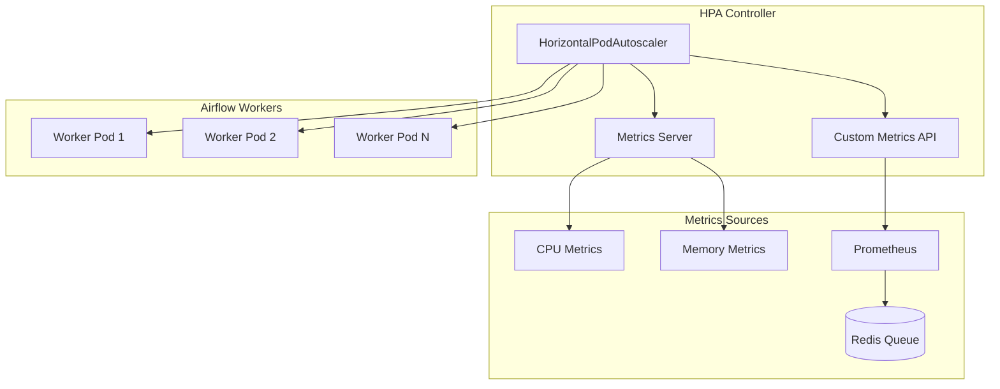

# Airflow Worker Horizontal Pod Autoscaler (HPA)

This document describes the implementation of horizontal pod autoscaling for Airflow workers, fulfilling requirements 5.1, 5.2, 5.3, 5.5, and 5.6 from the Airflow Kubernetes deployment specification.

## Overview

The HPA implementation provides automatic scaling of Airflow worker pods based on:
- CPU utilization (primary metric)
- Memory utilization (secondary metric)  
- Queue depth (custom metric, when available)
- Worker utilization (custom metric, when available)

## Architecture



## Requirements Implementation

### Requirement 5.1: Horizontal Pod Autoscaling
- ✅ HPA configured for Airflow worker deployment
- ✅ Automatic scaling based on resource utilization
- ✅ Integration with Kubernetes metrics server

### Requirement 5.2: Scale Up on Queue Length Increase
- ✅ Custom metrics for queue depth monitoring
- ✅ Prometheus rules for queue length calculation
- ✅ HPA scaling triggers based on queue depth

### Requirement 5.3: Scale Down on Queue Length Decrease
- ✅ Conservative scale-down policies
- ✅ Stabilization windows to prevent thrashing
- ✅ Gradual replica reduction

### Requirement 5.5: Resource Constraint Handling
- ✅ Maximum replica limits (10 pods)
- ✅ Resource requests and limits defined
- ✅ Node resource consideration in scaling

### Requirement 5.6: Automatic Worker Registration
- ✅ New pods automatically join Celery cluster
- ✅ Health checks ensure proper initialization
- ✅ Graceful pod termination handling

## Configuration Files

### Core HPA Files
- `airflow-worker-hpa.yaml` - Basic HPA with resource metrics
- `airflow-worker-hpa-advanced.yaml` - Advanced HPA with custom metrics
- `airflow-queue-metrics.yaml` - Prometheus rules for queue metrics

### Deployment Scripts
- `deploy-airflow-hpa.sh` - Automated HPA deployment
- `test-airflow-hpa.sh` - HPA functionality testing

### Configuration Updates
- `airflow-values.yaml` - Updated worker configuration for HPA

## HPA Configurations

### Basic HPA (Resource Metrics Only)
```yaml
minReplicas: 2
maxReplicas: 10
metrics:
  - CPU: 70% utilization
  - Memory: 80% utilization
```

### Advanced HPA (With Custom Metrics)
```yaml
minReplicas: 2
maxReplicas: 10
metrics:
  - CPU: 70% utilization
  - Memory: 80% utilization
  - Queue depth: >20 tasks
  - Worker utilization: >85%
```

## Scaling Behavior

### Scale-Up Policies
- **Aggressive scaling** for handling traffic spikes
- **Stabilization window**: 60 seconds
- **Maximum increase**: 100% (double pods) or 3 pods
- **Quick response**: 1 pod every 30 seconds for urgent needs

### Scale-Down Policies
- **Conservative scaling** to avoid thrashing
- **Stabilization window**: 300 seconds (5 minutes)
- **Maximum decrease**: 50% of pods or 1 pod at a time
- **Gradual reduction**: Prevents service disruption

## Custom Metrics

### Queue Depth Metrics
```promql
# Average queue depth over 5 minutes
airflow:queue_depth:avg5m = avg_over_time(
  (airflow_celery_queue_length{queue="default"} or
   redis_list_length{list="celery"})[5m:]
)
```

### Worker Utilization Metrics
```promql
# Worker utilization percentage
airflow:worker_utilization:avg5m = (
  sum(airflow_celery_active_tasks) /
  sum(airflow_celery_worker_count)
) * 100
```

## Deployment

### Prerequisites
1. Kubernetes cluster with metrics server
2. Airflow deployed with worker pods
3. Prometheus monitoring stack (for custom metrics)
4. Optional: prometheus-adapter for custom metrics API

### Basic Deployment
```bash
# Deploy HPA with resource metrics only
./deploy-airflow-hpa.sh
```

### Advanced Deployment (with custom metrics)
```bash
# Requires prometheus-adapter
# Deploy HPA with queue-based scaling
./deploy-airflow-hpa.sh
```

## Testing

### Automated Testing
```bash
# Run comprehensive HPA tests
./test-airflow-hpa.sh
```

### Manual Testing
```bash
# Monitor HPA status
kubectl get hpa airflow-worker-hpa -n airflow --watch

# Monitor worker pods
kubectl get pods -n airflow -l component=worker --watch

# Generate CPU load
kubectl run load-test --image=busybox --restart=Never -- /bin/sh -c "while true; do echo test; done"

# Check scaling events
kubectl describe hpa airflow-worker-hpa -n airflow
```

## Monitoring

### Key Metrics to Monitor
- Current replica count vs. desired
- CPU and memory utilization
- Queue depth and processing rate
- Scaling events and frequency
- Pod startup/termination times

### Grafana Dashboard Queries
```promql
# Current worker replicas
kube_deployment_status_replicas{deployment="airflow-worker", namespace="airflow"}

# HPA target utilization
kube_hpa_status_current_replicas{hpa="airflow-worker-hpa", namespace="airflow"}

# Queue depth
airflow:queue_depth:avg5m

# Worker utilization
airflow:worker_utilization:avg5m
```

## Troubleshooting

### Common Issues

#### HPA Not Scaling
1. **Check metrics server**: `kubectl get apiservices v1beta1.metrics.k8s.io`
2. **Verify resource requests**: Pods must have CPU/memory requests defined
3. **Check HPA status**: `kubectl describe hpa airflow-worker-hpa -n airflow`

#### Custom Metrics Not Working
1. **Verify prometheus-adapter**: `kubectl get apiservices v1beta1.custom.metrics.k8s.io`
2. **Check Prometheus rules**: Ensure metrics are being generated
3. **Validate metric queries**: Test queries in Prometheus UI

#### Scaling Too Aggressive/Conservative
1. **Adjust thresholds**: Modify CPU/memory utilization targets
2. **Tune stabilization windows**: Increase/decrease based on workload
3. **Review scaling policies**: Adjust percentage and pod-based limits

### Debug Commands
```bash
# Check HPA status
kubectl get hpa -n airflow
kubectl describe hpa airflow-worker-hpa -n airflow

# Check metrics
kubectl top pods -n airflow
kubectl get --raw "/apis/metrics.k8s.io/v1beta1/namespaces/airflow/pods"

# Check custom metrics (if available)
kubectl get --raw "/apis/custom.metrics.k8s.io/v1beta1/namespaces/airflow/services/*/airflow_queue_depth"

# Check events
kubectl get events -n airflow --sort-by='.lastTimestamp'
```

## Performance Considerations

### Resource Planning
- **Minimum replicas**: Set based on baseline load (default: 2)
- **Maximum replicas**: Consider node capacity and resource limits (default: 10)
- **Resource requests**: Must be realistic for accurate scaling decisions

### Scaling Timing
- **Scale-up**: Fast response to handle traffic spikes (60s stabilization)
- **Scale-down**: Conservative to avoid thrashing (300s stabilization)
- **Metrics collection**: 30-second intervals for responsive scaling

### Cost Optimization
- **Right-sizing**: Ensure worker resource requests match actual usage
- **Scale-to-zero**: Not recommended for Airflow workers (minimum 2 replicas)
- **Spot instances**: Consider for worker nodes to reduce costs

## Security Considerations

### RBAC Permissions
The HPA controller requires permissions to:
- Read deployment and pod metrics
- Scale deployment replicas
- Access custom metrics APIs

### Network Policies
Ensure HPA controller can access:
- Metrics server endpoints
- Custom metrics API endpoints
- Target deployment pods

## Integration with Existing Infrastructure

### Prometheus Integration
- Uses existing Prometheus stack for custom metrics
- Leverages ServiceMonitor for metrics collection
- Integrates with existing alerting rules

### Grafana Integration
- Custom dashboards for HPA monitoring
- Integration with existing Airflow dashboards
- Alerting for scaling events and failures

### Vault Integration
- No direct integration required
- Worker pods use existing Vault secrets
- Scaling operations preserve secret access

## Future Enhancements

### Planned Improvements
1. **Predictive scaling** based on DAG schedules
2. **Multi-dimensional scaling** with additional custom metrics
3. **Integration with cluster autoscaler** for node scaling
4. **Advanced queue metrics** with task priority consideration

### Custom Metrics Expansion
- Task failure rate metrics
- DAG execution time metrics
- Resource utilization per task type
- Queue processing velocity

## References

- [Kubernetes HPA Documentation](https://kubernetes.io/docs/tasks/run-application/horizontal-pod-autoscale/)
- [Custom Metrics API](https://github.com/kubernetes/community/blob/master/contributors/design-proposals/instrumentation/custom-metrics-api.md)
- [Prometheus Adapter](https://github.com/kubernetes-sigs/prometheus-adapter)
- [Airflow Monitoring](https://airflow.apache.org/docs/apache-airflow/stable/logging-monitoring/metrics.html)