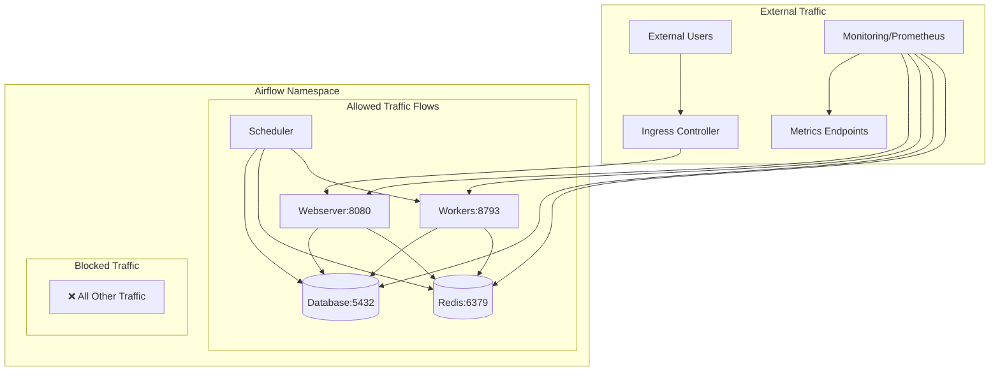

# Airflow Network Policies

This document describes the network security policies implemented for the Airflow Kubernetes deployment. These policies provide defense-in-depth security by controlling network traffic between components.

## Overview

The network policies implement a zero-trust network model where:
1. **All ingress traffic is denied by default**
2. **Specific allow rules** are defined for required communication patterns
3. **Monitoring access** is explicitly allowed from the monitoring namespace
4. **External access** is controlled through ingress controllers

## Network Policy Architecture



## Implemented Network Policies

### 1. Default Deny Policy (`airflow-deny-all-ingress`)

**Purpose**: Implements default-deny for all ingress traffic to any pod in the Airflow namespace.

```yaml
spec:
  podSelector: {}  # Applies to all pods
  policyTypes:
  - Ingress        # Only affects ingress traffic
```

**Effect**: 
- ❌ Blocks all incoming traffic by default
- ✅ Allows egress traffic (outbound connections)
- ✅ Allows traffic explicitly permitted by other policies

### 2. Webserver Ingress Policy (`airflow-webserver-ingress`)

**Purpose**: Allows external access to Airflow webserver through ingress controller.

**Allowed Traffic**:
- ✅ From Traefik ingress controller (kube-system namespace) → Webserver:8080
- ✅ From monitoring namespace → Webserver:8080 (metrics)

**Blocked Traffic**:
- ❌ Direct access from other namespaces
- ❌ Access to non-webserver components

### 3. Component Egress Policies

#### Scheduler Egress (`airflow-scheduler-egress`)
**Allowed Outbound**:
- ✅ PostgreSQL:5432 (metadata database)
- ✅ Redis:6379,26379 (task queue)
- ✅ Workers:8793 (task distribution)
- ✅ DNS:53 (name resolution)
- ✅ HTTPS:443 (external services, Vault)

#### Worker Egress (`airflow-worker-egress`)
**Allowed Outbound**:
- ✅ PostgreSQL:5432 (task status updates)
- ✅ Redis:6379,26379 (task queue)
- ✅ DNS:53 (name resolution)
- ✅ HTTPS:443 (external services)

#### Webserver Egress (`airflow-webserver-egress`)
**Allowed Outbound**:
- ✅ PostgreSQL:5432 (metadata queries)
- ✅ Redis:6379,26379 (session storage)
- ✅ DNS:53 (name resolution)
- ✅ HTTPS:443 (authentication, external APIs)

### 4. Database Access Policies

#### PostgreSQL Ingress (`postgresql-airflow-ingress`)
**Allowed Inbound**:
- ✅ From Airflow components → PostgreSQL:5432
- ✅ From monitoring namespace → PostgreSQL:9187 (metrics)

#### Redis Ingress (`redis-airflow-ingress`)
**Allowed Inbound**:
- ✅ From Airflow components → Redis:6379,26379
- ✅ From monitoring namespace → Redis:9121 (metrics)

### 5. Monitoring Access Policy (`airflow-monitoring-ingress`)

**Purpose**: Allows Prometheus to scrape metrics from all Airflow components.

**Allowed Traffic**:
- ✅ From monitoring namespace → All Airflow pods
- ✅ Ports: 8080 (webserver), 8793 (workers), 9102 (general metrics)

## Security Benefits

### 1. **Zero Trust Network Model**
- No implicit trust between components
- Every connection must be explicitly allowed
- Reduces attack surface significantly

### 2. **Lateral Movement Prevention**
- Compromised pods cannot freely access other components
- Database access restricted to legitimate Airflow components
- External access controlled through defined entry points

### 3. **Monitoring Integration**
- Dedicated policies for metrics collection
- Prometheus can access all necessary endpoints
- No overly broad monitoring permissions

### 4. **Compliance Support**
- Network segmentation for regulatory requirements
- Audit trail of allowed network communications
- Defense-in-depth security architecture

## Prerequisites

### CNI Requirements
Network policies require a CNI that supports the NetworkPolicy API:

**Supported CNIs**:
- ✅ Calico
- ✅ Cilium
- ✅ Weave Net
- ✅ Antrea
- ✅ Kube-router

**Unsupported CNIs**:
- ❌ Flannel (without additional components)
- ❌ Basic kubenet

### Namespace Labels
Ensure the monitoring namespace has the correct label:
```bash
kubectl label namespace monitoring name=monitoring
```

## Deployment

### 1. Deploy Network Policies
```bash
# Deploy all network policies
./deploy-airflow-network-policies.sh

# Check status
./deploy-airflow-network-policies.sh status
```

### 2. Verify Deployment
```bash
# Run comprehensive tests
./test-airflow-network-policies.sh

# Check specific policies
kubectl get networkpolicies -n airflow
```

### 3. Monitor Policy Effectiveness
```bash
# View policy details
kubectl describe networkpolicy airflow-deny-all-ingress -n airflow

# Check for policy violations (if supported by CNI)
kubectl get events -n airflow | grep NetworkPolicy
```

## Testing

### Automated Testing
The `test-airflow-network-policies.sh` script provides comprehensive testing:

```bash
# Run all tests
./test-airflow-network-policies.sh test

# Check policy existence
./test-airflow-network-policies.sh check

# Clean up test resources
./test-airflow-network-policies.sh cleanup
```

### Manual Testing

#### Test Deny-All Policy
```bash
# Create test pod in different namespace
kubectl run test-pod --image=busybox --rm -it --restart=Never \
  --namespace=default -- sh

# Try to access Airflow webserver (should fail)
nc -z <webserver-ip> 8080
```

#### Test Monitoring Access
```bash
# From monitoring namespace
kubectl run test-pod --image=busybox --rm -it --restart=Never \
  --namespace=monitoring -- sh

# Try to access metrics (should succeed)
wget -qO- http://<webserver-ip>:8080/metrics
```

## Troubleshooting

### Common Issues

#### 1. CNI Doesn't Support NetworkPolicies
**Symptoms**: Policies are created but not enforced
**Solution**: 
- Install a compatible CNI (Calico recommended)
- Or use alternative security measures (PodSecurityPolicies, service mesh)

#### 2. Monitoring Can't Access Metrics
**Symptoms**: Prometheus scraping fails
**Solution**:
```bash
# Check monitoring namespace label
kubectl get namespace monitoring --show-labels

# Add required label if missing
kubectl label namespace monitoring name=monitoring
```

#### 3. Webserver Not Accessible
**Symptoms**: External access fails
**Solution**:
```bash
# Check ingress controller namespace and labels
kubectl get pods -n kube-system -l app.kubernetes.io/name=traefik

# Verify ingress controller labels match policy
kubectl describe networkpolicy airflow-webserver-ingress -n airflow
```

#### 4. Inter-Component Communication Fails
**Symptoms**: Scheduler can't reach database/Redis
**Solution**:
```bash
# Check pod labels match policy selectors
kubectl get pods -n airflow --show-labels

# Verify service names and ports
kubectl get services -n airflow
```

### Debugging Commands

```bash
# List all network policies
kubectl get networkpolicies -n airflow

# Describe specific policy
kubectl describe networkpolicy <policy-name> -n airflow

# Check pod labels
kubectl get pods -n airflow --show-labels

# View policy-related events
kubectl get events -n airflow --field-selector reason=NetworkPolicyViolation

# Test connectivity from pod
kubectl exec -it <pod-name> -n airflow -- nc -z <target-ip> <port>
```

## Customization

### Adding New Components

When adding new Airflow components, update the relevant policies:

1. **Add egress rules** for new component communication needs
2. **Add ingress rules** for components that need to receive traffic
3. **Update monitoring policy** if the component exposes metrics
4. **Test the changes** using the test script

### Example: Adding Flower UI

```yaml
# Add to airflow-security-policies.yaml
---
apiVersion: networking.k8s.io/v1
kind: NetworkPolicy
metadata:
  name: airflow-flower-ingress
  namespace: airflow
spec:
  podSelector:
    matchLabels:
      app.kubernetes.io/component: flower
  policyTypes:
  - Ingress
  ingress:
  - from:
    - namespaceSelector:
        matchLabels:
          name: kube-system
      podSelector:
        matchLabels:
          app.kubernetes.io/name: traefik
    ports:
    - protocol: TCP
      port: 5555
```

### Environment-Specific Adjustments

#### Development Environment
- Consider more permissive policies for debugging
- Add temporary allow-all policies during development
- Use separate namespace for testing

#### Production Environment
- Implement strictest possible policies
- Regular policy audits and updates
- Monitor for policy violations
- Document all exceptions

## Security Considerations

### 1. **Policy Ordering**
- Deny-all policy should be applied first
- Allow policies are additive
- More specific selectors take precedence

### 2. **Label Management**
- Consistent labeling strategy is critical
- Labels determine policy application
- Regular label audits recommended

### 3. **Monitoring and Alerting**
- Monitor for policy violations
- Alert on unexpected network patterns
- Regular policy effectiveness reviews

### 4. **Backup and Recovery**
- Version control all policy definitions
- Test policy changes in staging first
- Have rollback procedures ready

## Integration with Other Security Measures

### Pod Security Standards
Network policies complement Pod Security Standards:
- Network policies control traffic flow
- Pod Security Standards control pod capabilities
- Both should be implemented together

### Service Mesh Integration
If using a service mesh (Istio, Linkerd):
- Network policies provide L3/L4 security
- Service mesh provides L7 security
- Policies can work together for defense-in-depth

### Vault Integration
Network policies support Vault integration:
- HTTPS egress allows Vault communication
- Specific policies for Vault agent sidecars
- Secure secret retrieval patterns

## Maintenance

### Regular Tasks

#### Monthly
- Review policy effectiveness
- Update policies for new components
- Test policy changes in staging

#### Quarterly
- Full security audit of network policies
- Update documentation
- Review and update test scripts

#### Annually
- Complete policy architecture review
- Evaluate new security features
- Update security baselines

### Policy Updates
When updating policies:
1. Test changes in development environment
2. Update documentation
3. Run automated tests
4. Deploy to staging
5. Monitor for issues
6. Deploy to production
7. Update runbooks

## References

- [Kubernetes Network Policies](https://kubernetes.io/docs/concepts/services-networking/network-policies/)
- [Calico Network Policy](https://docs.projectcalico.org/security/kubernetes-network-policy)
- [Cilium Network Policy](https://docs.cilium.io/en/stable/policy/)
- [Airflow Security Best Practices](https://airflow.apache.org/docs/apache-airflow/stable/security/index.html)